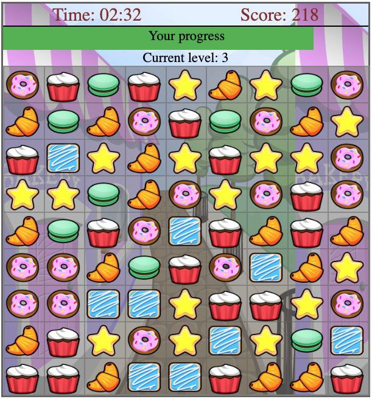

# Candy Crush - Vanilla JavaScript

A simplified web version of the classic Candy Crush game built entirely with **Vanilla JavaScript**, **HTML**, and **CSS**.

## Objective
Match 3 or more cookies of the same type horizontally or vertically to eliminate them, earn points, and progress through multiple levels. Each new level increases the number of cookie types, making the game more challenging. To add a challange to the game, you can switch cookies only in case if this action will cause existing cookies to disappear.

---

## Features

- Dynamic 9x9 cookie grid generated at the start of each level
- User interactions:
  - Click to select and swap adjacent cookies
  - Drag and drop support for intuitive gameplay
- Automatic detection of valid matches (3 or more)
- Smooth animations when cookies disappear and regenerate
- Scoring system with a visible progress bar
- Multiple levels with increasing difficulty
- Auto-saving of top scores using `localStorage` on page reload
- End-of-game screen with restart option upon reaching the final level

---

## Project Structure

```
.
├── assets/
│   └── images/           # Cookie images
├── css/
│   └── styles.css        # Game styling
├── js/
│   ├── cookie.js         # Cookie class (individual model)
│   ├── grille.js         # Main game logic (grid controller)
│   ├── utils.js          # Utility functions
│   └── script.js         # Entry point (game initializer)
├── lib/
│   └── lodash.js         # Lib initializing
├── index.html            # Main HTML file
└── README.md             # Project documentation
```

---

## Running the Game Locally

1. Clone the repository:
```bash
git clone https://github.com/your-username/candy-crush-vanilla.git
```
2. Launch `live server` to start a game in your Visual Studio Code environment.

---

## Preview
Random screenshot from gameplay:



---

## Possible Improvements
- Add background music and sound effects
- Add helper in case when you can't find a combination by yourself
- Introduce power-ups (e.g., bombs, lines, special cookies)
- Make the layout responsive for mobile
- Add a backend to save global scores

---

## About
Developed by Nikita Budeanski (@NikBud) as a personal project to learn and practice JavaScript, animations, and DOM manipulation.
